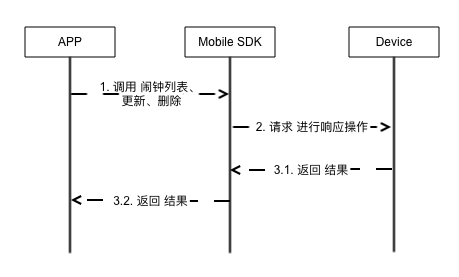

# 闹钟 Alarm

### 流程



### 获取闹钟列表
获取设备的闹钟列表

**接口定义**

Swift:

```swift
RokidMobileSDK.skill?.alarm.getList(deviceId: String,
                            completion: @escaping (error: RKError?, alarms: [SDKAlarm]?) -> Void)
```

Objc:

```objc
[RokidMobileSDK.skill.alarm getListWithDeviceId:self.device.id  completion:^(RKError * error   , NSArray<SDKAlarm *> * alarmArr) {
    // ...
}];
```

SDKAlarm 字段说明：

| 参数 | 类型 | 必要？ | 说明 |
| --- | --- | --- | --- |
| id |  int| 是 | 闹钟Id |
| year | int | 是 | 年 |
| month | int | 是 |  月|
| day | int | 是 | 日 |
| hour | int | 是 | 小时 |
| minute | int | 是 | 分钟 |
| date | String | 是 | 重复模式的文案 |
| ext | Map<String, String> | 是 | 扩展字段，根据自己业务进行扩展 |

<font color='red'>
注：目前只有Lua版Linux系统支持该字段
    ext字段是手机App与系统通信特有的字段，添加或修改时传入，获取列表时原样返回，以下划线_开始的key是预定义key。
    ext字段可以为空；因为暂时没有删除字段的接口，所以修改时(SpecificTime)需要传入所有的key和value。
  系统不支持时间完全相同的闹钟，所以更新和删除时不会校验ext是否匹配。
</font>

| 名称 | 类型 | 描述 |
| --- | --- | --- |
| _ringtone | string | 闹钟铃声地址，会覆盖全局的闹钟主题 |
    
<font color='red'>
第三方需求可以由他们自定义字段，比如小雅小雅的标签需求
</font>

---

### 新建闹钟
新建一个闹钟

**接口定义**

Swift:

```swift
RokidMobileSDK.skill?.alarm.create(deviceId: String, alarm: SDKAlarm)
```

Objc:

```objc
SDKAlarm * alarm = [SDKAlarm init];
alarm.year = 2018;
// ...

[RokidMobileSDK.skill.alarm createWithDeviceId:@"xxx" alarm: alarm];
```

repeatType 解释：

```
SDKAlarmRepeatModeOnce : 仅此一次
SDKAlarmRepeatModeEveryday : 每天
SDKAlarmRepeatModeWeekday : 工作日
SDKAlarmRepeatModeWeekend : 每周末
SDKAlarmRepeatModeEveryMonday : 每周一
SDKAlarmRepeatModeEveryTuesday : 每周二
SDKAlarmRepeatModeEveryWednesday : 每周三
SDKAlarmRepeatModeEveryThursday : 每周四
SDKAlarmRepeatModeEveryFriday : 每周五
SDKAlarmRepeatModeEverySaturday : 每周六
SDKAlarmRepeatModeEverySunday : 每周日
```

---

### 删除闹钟

删除一个闹钟

**接口定义**

Swift:

```swift
RokidMobileSDK.skill?.alarm.delete(deviceId: String, alarm: SDKAlarm)
```

Objc:

```objc
[RokidMobileSDK.skill.alarm deleteWithDeviceId:@"xxx" alarm: alarm];
```

---


### 更新闹钟
更新一个闹钟

**接口定义**

Swift:

```swift
RokidMobileSDK.skill?.alarm.update(deviceId: String, alarm: SDKAlarm, to: SDKAlarm)
```

Objc:

```objc
[RokidMobileSDK.skill.alarm updateWithDeviceId:@"XXX" alarm:alarm to:alarmNew];
```

---

